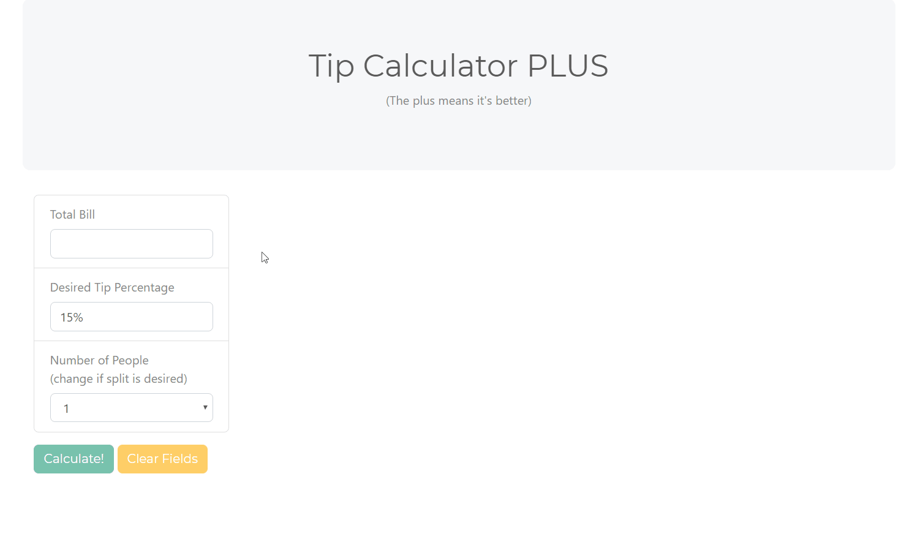
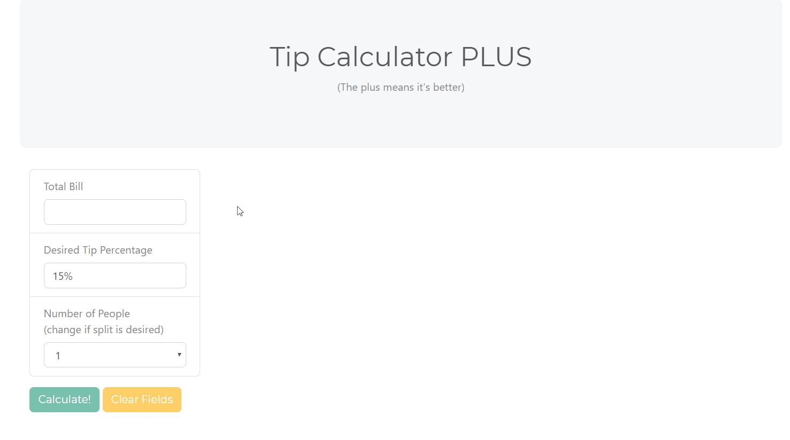
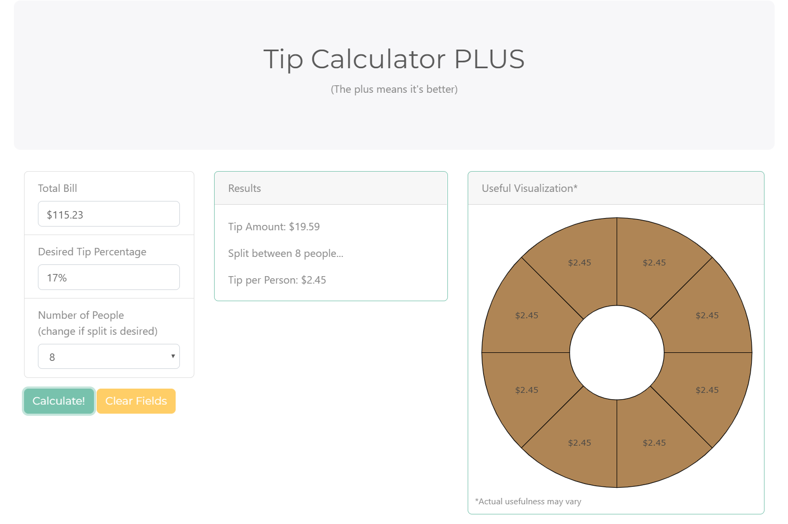
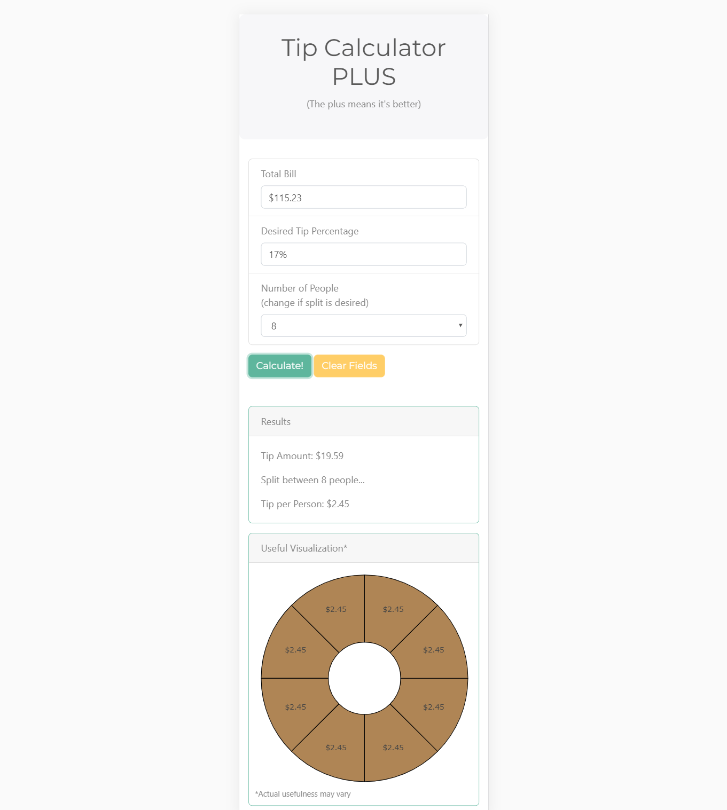

# Tip Calculator PLUS

**Description**  
The purpose of this project was to create a user-friendly app to calculate a tip at a restaurant, and provide the option to split the tip between multiple people.  This app has been deployed to [Heroku](https://tip-calculator-plus.herokuapp.com), and is fully responsive for use on mobile and desktop.

---

**App Usage**  

The app allows user input of the Total Bill, the Desired Tip Percentage, and offers the option to split the tip between multiple people.  The fields will reformat after a valid number is entered (using focusout event listeners).  Plotly was also used in order to display a visualization showing split amounts if the split option is chosen.

---

**Error Checking**  

Alerts will be displayed and the errant field(s) will be reset if the user attempts to calculate using zero or a negative value for the total bill or desired tip percentage, or if the value entered into either field is not a valid number.  

---

**Responsive Layouts**  

  * Desktop Layout  

  * Mobile Layout  

